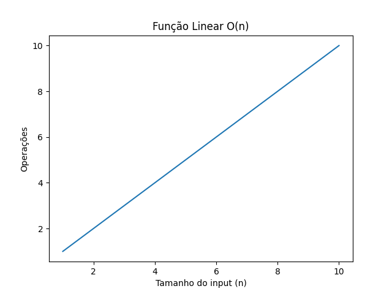

<h1>Análise Assintotica</h1>

<p>Análise assintotica é uma forma de medir a performance de um algoritmo conforme a quantidade de dados recebida.</p>

<h3>Operações vs Tamanho do input (n)</h3>

Quando pensamos em Big O Notation, buscamos a quantidade de operações ao longo do tamanho do input de informações ou o quão escalável é um algoritmo com quantidade cada vez maiores de dados.

Vamos analisar a seguinte função.

```go
func sumNumbers(arr []int) int{
	sum := 0
	for i := 0; i < len(arr); i++{
		sum += arr[i]
	}
	return sum
}
```

<p>A função acima tem um comportamento linear, já que o número de operações cresce conforme o tamanho do input.</p>
<p>


</p>

<p>Analise completa do algoritmo:</p>

```go
func sumNumbers(arr []int) int{
	sum := 0 // -> 1 operação executada
	for i := 0; i < len(arr); i ++{ // -> len(arr) (n) - n operações executadas
	  sum += arr[i] // -> 1 operação executada
	}
	  return sum // -> 1 operação executada
}
```

Agora vamos pega a quantidade de operações e construir uma fórmula matemática.

O = 1 + (n \* 1) + 1
<br>
O = 1 + n + 1
<br>
O = n + 2
<br>

Logo, chegamos na análise assintotica da função, O(n+2)!

Isso significa que:

Se n = 100 então O = 102

Se n = 100.000 então O = 100.002

Se n = 100.000.000 então O = 100.000.002

Se n = 1.000.000.000 então O = 1.000.000.002

Podemos perceber que quanto maior for o valor de n, mais irrelevante se torna o valor 2, logo o que importa de fato é o maior termo.

O(n+2) => O(n) [Linear], já que o que importa é o maior termo.

#### Analisando a função do desafio "First Uniq Char"

```go
func FirstUniqChar(s string) int {
	arr := [26]int{} // -> 1 operação

	for _, value := range s { // -> n operações
		arr[value-97]++ // -> 1 operação
	}

	for i, value := range s { // -> n operações
		if arr[value-97] == 1  {
			return i // -> 1 operação
		}
	}

	return -1 // -> 1 operação
}
```

Podemos observar que a operação do retorno do index da primeira letra que não se repete em uma string também conta como uma operação, devemos ficar atentos que mesmo que uma condição não seja sempre verdadeira, estamos analisando o pior cenário possível, por exemplo uma string com todas as letras do alfabeto em ordem alfabética, onde a única letra que não se repete é a letra z ou que todas as letras se repitam.

```bash
aabbcc...xxwwz
```

Agora vamos construir a fórmula matemática a partir das operações observadas.

O(n) = 1 + (n\*1) + (n\*1) + 1
<br>
O(n) = 2 + n + n
<br>
O(n) = 2n + 2

Logo temos uma função Linear, que cresce conforme o tamanho do input.
